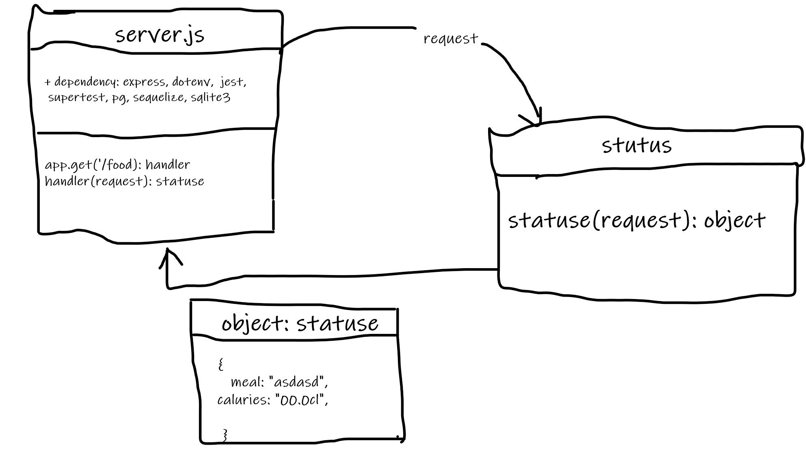

# basic-api-server

- description:

    - I did a simple crud api server that that saves data on postgres db, and tested all routes 
- features:

    - GET
    - POST
    - PUT
    - DELETE

- HEROKU: 
    - https://omars-basic-api-server.herokuapp.com/food
    - https://omars-basic-api-server.herokuapp.com/clothes

- test:

    - Unit Tests: `npm run test`
    - Lint Tests: `npm run dev`

 - UML 
       